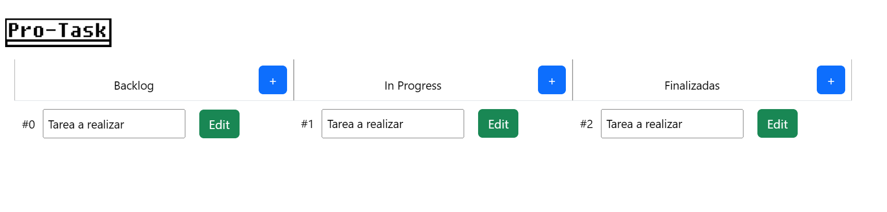

# adminDeTareas
Proyecto para supervisar tareas, flujo de trabajo

Desarrollado con Vue.js

Para ver la pagina web,
- cd vue-app
- npm run dev

# Preview

Tiene una variable que contiene las tareas iniciales.

Esto crea tres tablas: Backlog , In Progress , Finalizadas

Funciones:
1. Agregar nueva tarea con un boton + al lado del encabezado de cada tabla.
2. Modificar el nombre de una tarea, con el boton + que tiene cada tarea.
3. Modifica el status, o pasar a otra tabla una tarea con el boton + que tiene la tabla.
4. Se puede modificar solo el nombre posicionandosé en el nombre de la tarea.
